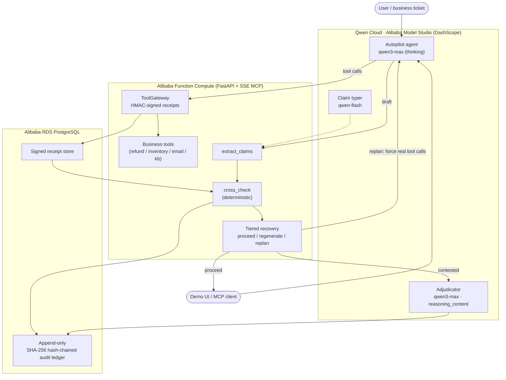

# ReceiptGuard — Architecture



## Data flow
1. A ticket enters via the demo UI or an MCP client; the **qwen3-max** autopilot
   agent plans and calls business tools.
2. Every tool call is proxied by **ToolGateway**, which executes it and writes an
   **HMAC-signed receipt** (the agent cannot forge one).
3. The agent's draft is split into typed atomic claims (**qwen-flash**).
4. **cross_check** (pure, deterministic) matches each tool-derived claim to the
   receipts: unbacked / contradicted / false-absence / backed.
5. **Tiered recovery** scores groundedness and decides proceed / regenerate /
   replan under a compute budget; **qwen3-max thinking** adjudicates contested
   claims and its `reasoning_content` becomes the audit justification.
6. Every verification + decision is appended to the **hash-chained audit ledger**
   (SQLite locally, Alibaba RDS PostgreSQL in production).

## Adapter boundaries
- `llm/` is the only module that talks to Alibaba/DashScope (OpenAI-compatible).
- `gateway/` owns receipts; `verify/` + `recovery/` are pure logic; `audit/` is
  append-only and isolated from business logic.
- No API key → `llm/` returns deterministic mock responses; the whole system runs
  offline with identical verification behavior.
```
